# Numerical Electromagnetics Benchmark: Sparse FDM and BEM/MoM

## Purpose
This repository is a numerical electromagnetics benchmark for electrostatic field and capacitance modeling. It compares two classical computational strategies:

1. **sparse domain discretization** using the Finite Difference Method;
2. **dense boundary discretization** using a panel-based Method of Moments / Boundary Element formulation.

The project is not a single Laplace-equation demonstration. It is organized as a benchmark study: formulation, validation, refinement, conditioning, solver cost, non-rectangular geometry, charge concentration, and storage scaling.

---

## Research Question
The central question is:

> How do sparse domain methods and dense boundary methods behave on electrostatic problems when accuracy, refinement, conditioning, and computational cost are compared systematically?

This framing makes the project a numerical methods study rather than a plotting exercise.

---

## Scope
The benchmark includes:

- sparse finite-difference matrix assembly for Laplace boundary-value problems;
- analytical validation for a canonical rectangular electrostatic problem;
- grid-convergence analysis;
- boundary-condition sensitivity;
- direct sparse solve versus conjugate-gradient solve comparison;
- masked-domain FDM for a non-rectangular L-shaped geometry;
- panel-based MoM/BEM capacitance extraction;
- isolated-plate and parallel-plate capacitance studies;
- recursive panel refinement from \(13\) to \(3328\) panels;
- edge charge-density concentration under refinement;
- influence-matrix conditioning;
- sparse FDM versus dense BEM storage growth.

The benchmark remains electrostatic. It does not attempt full-wave electromagnetics.

---

## Sparse FDM Formulation
The electric potential satisfies

\[
\nabla^2 V = 0.
\]

The finite-difference discretization produces

\[
A\mathbf{v}=\mathbf{b},
\]

where \(\mathbf{v}\) contains interior potentials and \(\mathbf{b}\) contains boundary contributions. The implementation does **not** use local relaxation updates.

The canonical rectangular case is compared with an analytical separated-variable solution. A second masked-domain case demonstrates that the same operator-assembly logic extends to non-rectangular geometries.

---

## BEM / MoM Formulation
The boundary formulation solves

\[
P\mathbf{q}=\mathbf{V},
\]

where \(\mathbf{q}\) contains panel charges. Capacitance is recovered from

\[
C=\frac{Q}{V_0}.
\]

The mesh starts with 13 panels and is refined recursively:

\[
13 \rightarrow 52 \rightarrow 208 \rightarrow 832 \rightarrow 3328.
\]

Both capacitance convergence and charge-density concentration are tracked.

---

## Results

| Figure | Interpretation |
|--------|----------------|
| Fig. 1 | Sparse finite-difference operator and local stencil connectivity. |
| Fig. 2 | Potential contours and electric field lines from the FDM solution. |
| Fig. 3 | FDM validation against the analytical series solution and interior error distribution. |
| Fig. 4 | FDM grid convergence and sparse matrix growth. |
| Fig. 5 | Boundary-condition sensitivity across four electrostatic cases. |
| Fig. 6 | L-shaped masked-domain FDM problem and corresponding sparse operator. |
| Fig. 7 | Recursive BEM/MoM panel refinement. |
| Fig. 8 | Capacitance convergence and influence-matrix conditioning. |
| Fig. 9 | Charge-density concentration near conductor edges. |
| Fig. 10 | Sparse FDM versus dense BEM storage growth. |
| Fig. 11 | Direct sparse solve versus conjugate-gradient solve cost and residual. |
| Fig. 12 | Accuracy proxy under FDM grid refinement and BEM panel refinement. |
| Fig. 13 | Summary of benchmark observations. |

---

## Figures

**Fig. 1 — Sparse FDM operator**  
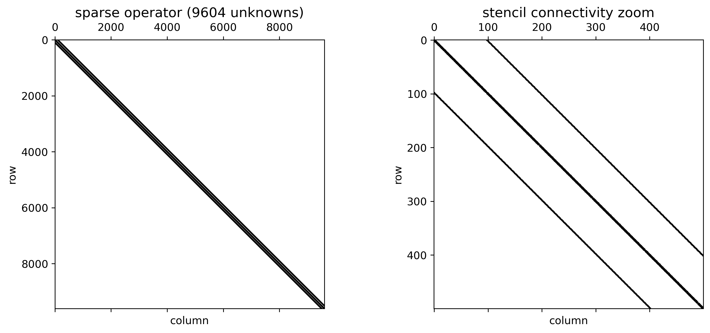

**Fig. 2 — Potential contours and electric field lines**  
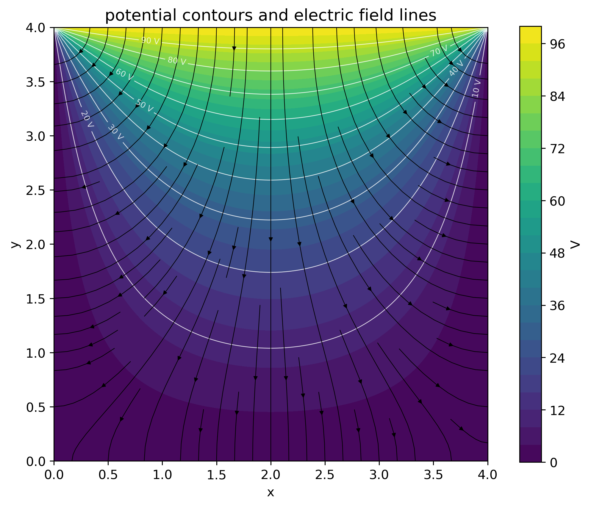

**Fig. 3 — Analytical validation and error**  
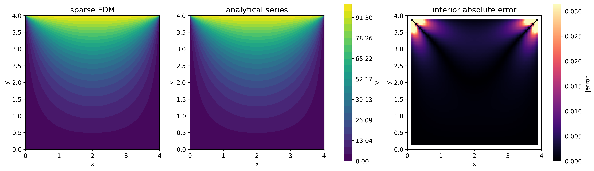

**Fig. 4 — FDM convergence and sparse scaling**  
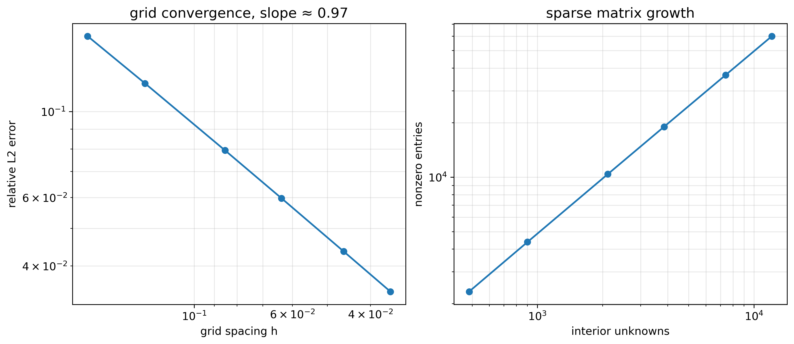

**Fig. 5 — Boundary-condition sensitivity**  
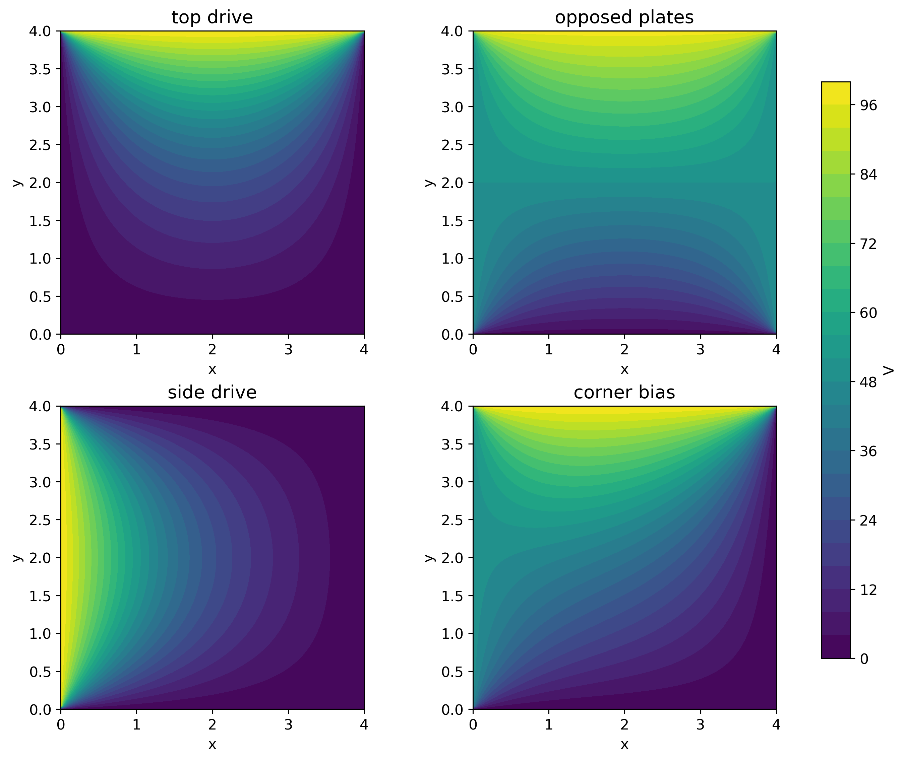

**Fig. 6 — L-shaped domain sparse FDM**  
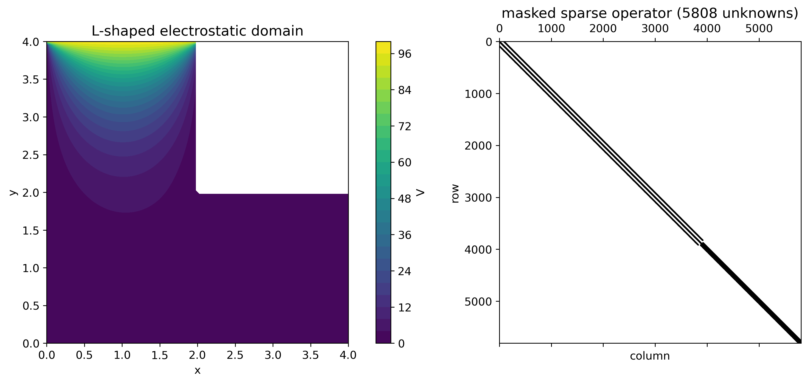

**Fig. 7 — BEM panel refinement**  
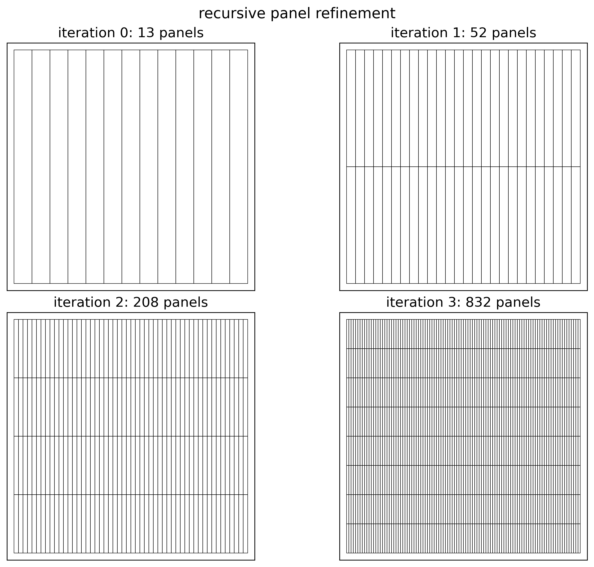

**Fig. 8 — Capacitance and conditioning**  
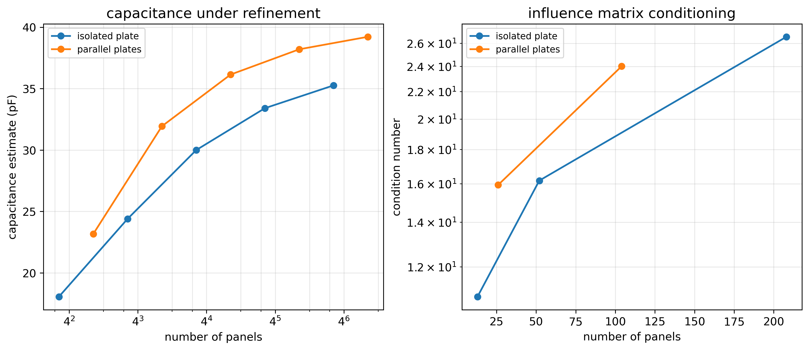

**Fig. 9 — Charge-density concentration**  
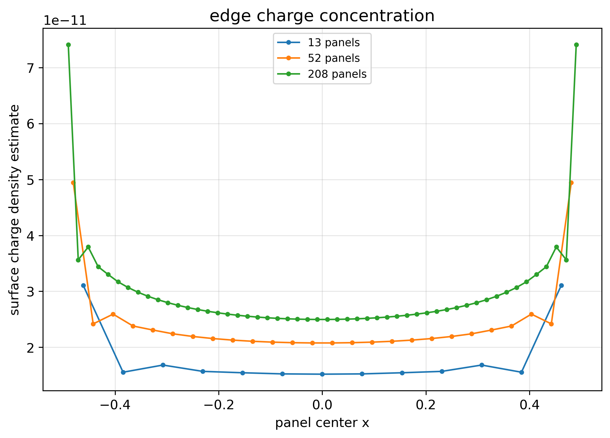

**Fig. 10 — Storage comparison**  
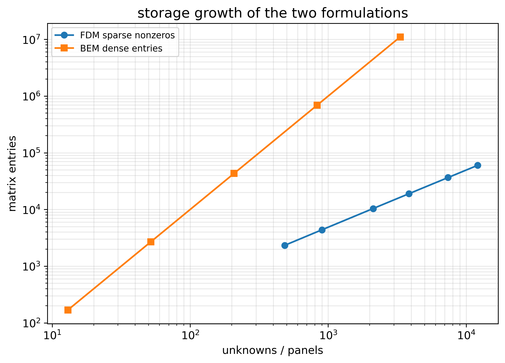

**Fig. 11 — Direct versus iterative sparse solve**  
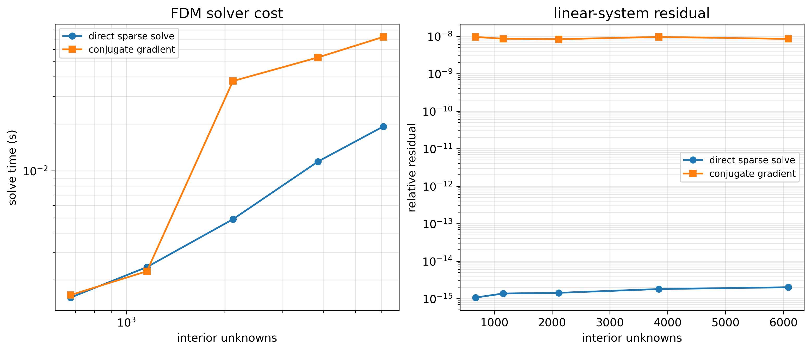

**Fig. 12 — Accuracy proxy under refinement**  
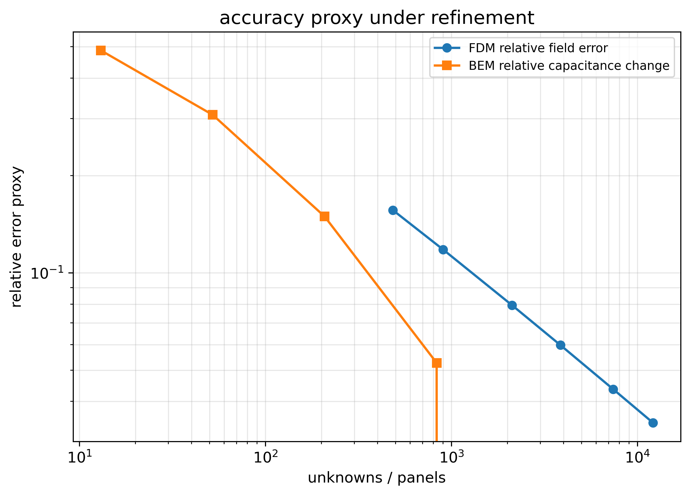

**Fig. 13 — Benchmark observations**  


---

## Repository Structure

```text
scripts/
  python/
    nem_benchmark/
      config.py
      fdm_matrix.py
      fdm_reference.py
      fdm_solver.py
      fdm_studies.py
      fdm_performance.py
      fdm_masked.py
      bem_geometry.py
      bem_operator.py
      bem_studies.py
      plot_fdm.py
      plot_bem.py
      plot_benchmark.py
      plot_research_plus.py
      plots.py
    run/
      run_all.py

  matlab/
    run_all.m
    fdm_sparse_electrostatics.m
    bem_panel_refinement.m

figures/
  fdm/
  bem/
  benchmark/

results/
  summary.json

docs/
  SCOPE.md
  METHODS.md
  CONCLUSIONS.md
  ROADMAP.md
```

---

## Conclusion
The benchmark shows the expected tradeoff: sparse FDM is natural for full-field solutions and scales through sparse operators, while BEM/MoM focuses computation on conductor boundaries but produces dense systems whose conditioning and storage cost grow rapidly under refinement. The strongest use of the two methods depends on whether the target quantity is the field in a region or the conductor response itself.
